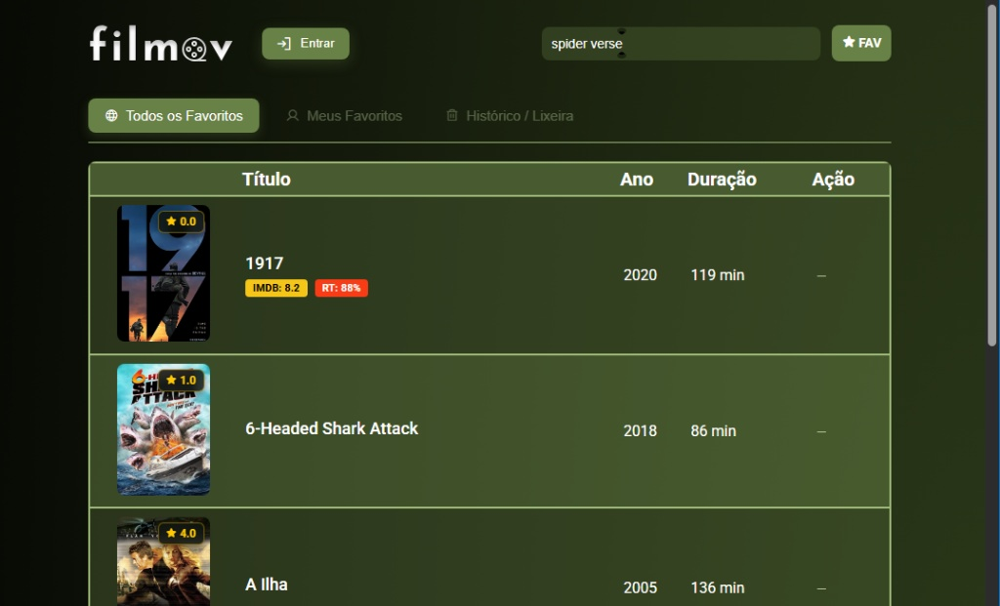
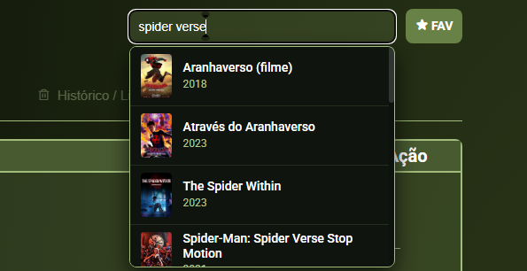
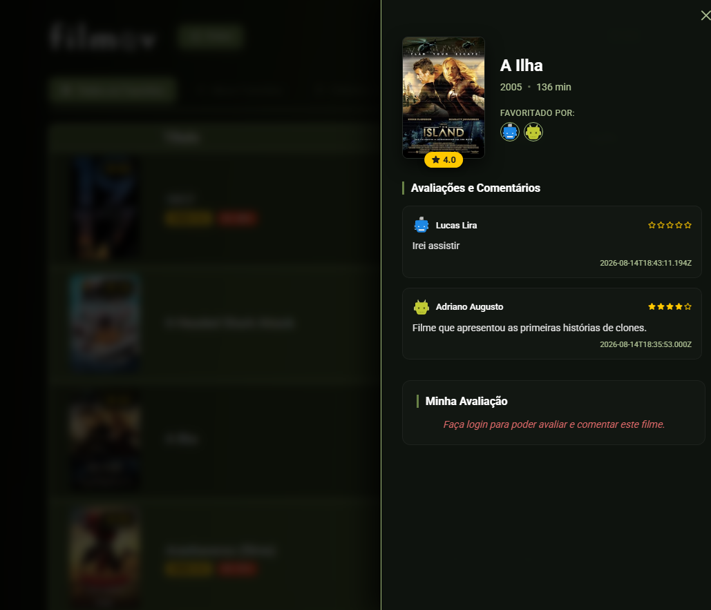
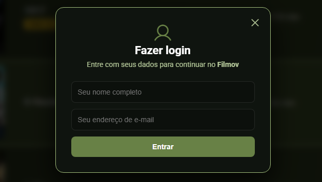

# 🎬 Filmov

> Uma aplicação web moderna e intuitiva para busca, catalogação, avaliação e gerenciamento de filmes favoritos.

<p align="center">
  
</p>

---

## 📌 Sobre o Projeto

O **Filmov** é uma plataforma focada na experiência do usuário para cinéfilos organizarem seus filmes preferidos, acompanharem notas (IMDb, Rotten Tomatoes) e registrarem suas próprias análises e avaliações em comunidade.

Construído com base em princípios modernos de **Engenharia de Software**, o projeto prioriza uma interface limpa com tema escuro estilizado, alta reatividade e desacoplamento de serviços (busca integrada, persistência de preferências e feedback social).

---

## ✨ Funcionalidades Principais

### 🔍 1. Busca Inteligente Multilíngue (Autocomplete)
- Busca dinâmica de títulos em português ou inglês em tempo real.
- Exibição de cartazes e ano de lançamento com carregamento otimizado.

<p align="center">
  
</p>

---

### ⭐ 2. Gerenciamento de Favoritos e Histórico
- **Todos os Favoritos:** Visão agregada da comunidade com pontuações IMDb / RT e médias gerais.
- **Meus Favoritos:** Lista customizada por usuário logado.
- **Histórico & Lixeira:** Controle de visualização e remoção segura de títulos.

<p align="center">
  
</p>

---

### 💬 3. Avaliações e Painel Detalhado (Side Drawer)
- Visualização de detalhes completos (ano, duração, nota média e lista de cinéfilos que favoritaram).
- Sistema de classificação por estrelas e comentários em tempo real.
- Histórico cronológico de opiniões da comunidade.

<p align="center">
  
</p>

---

### 🔐 4. Autenticação Simplificada
- Fluxo de entrada rápido por nome e e-mail, mantendo a sessão e vinculando histórico/avaliações ao perfil ativo.

<p align="center">
  
</p>

---

## 📐 Decisões Arquiteturais e Boas Práticas

- **Clean Architecture & Separation of Concerns (SoC):** Componentização modular (Interface de usuário, Modais, Camada de Serviço de API externa e Gerenciamento de Estado).
- **Tratamento de Estados de UI:** Feedback visual instantâneo para estados de carregamento (*loading*), busca vazia (*empty state*) e bloqueio contextual (ex: prompt amigável solicitando login para avaliar).
- **UX & Acessibilidade:** Contraste calibrado em paleta Dark/Olive Green, navegação fluida e transições suaves em *drawers* e *modals*.

---

## 🛠️ Tecnologias Utilizadas

- **Frontend:** HTML5, CSS3 / Custom Design System, JavaScript / TypeScript
- **API de Filmes:** Integração com APIs externas de cinema (ex: OMDb / TMDB)
- **Persistência / Estado:** Gerenciamento reativo de estado de sessão e catálogo

---

## 🚀 Como Executar o Projeto Localmente

### Pré-requisitos
- [Node.js](https://nodejs.org/) (versão LTS recomendada)
- Gerenciador de pacotes `npm`, `yarn` ou `pnpm`

### Instalação e Execução

```bash
# 1. Clone o repositório
git clone [https://github.com/lucaslirah/filmov.git](https://github.com/lucaslirah/filmov.git)

# 2. Acesse a pasta do projeto
cd filmov

# 3. Instale as dependências
npm install

# 4. Inicie o servidor de desenvolvimento
npm run dev
